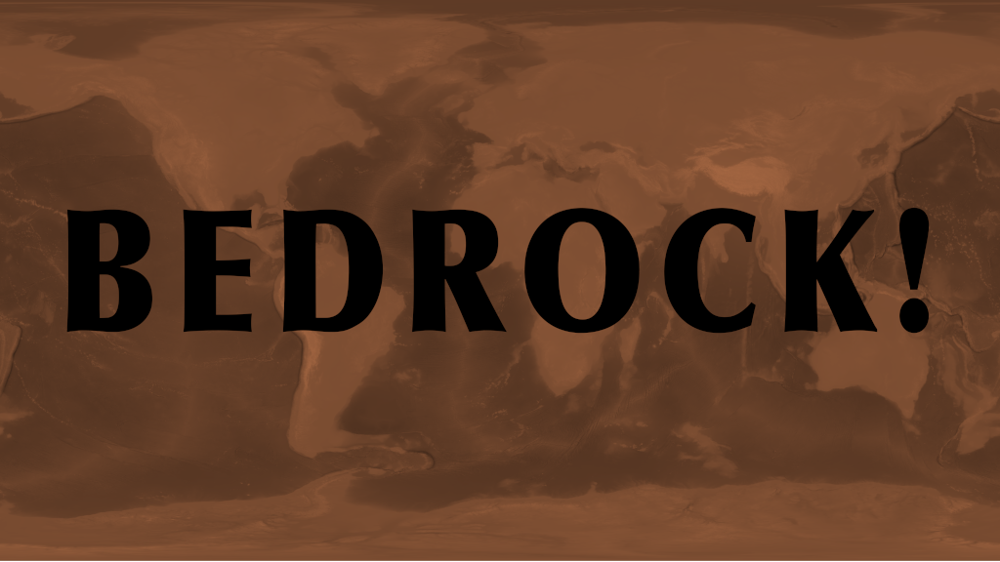

# bedrock

### Updated for 2022 ETOPO 30 Arc Second High Resolution

GMT 6 and ETOPO 2020 Docker image [Bedrock](https://hub.docker.com/r/jac18281828/bedrock)

[Releases](https://github.com/jac18281828/bedrock/releases)



Ice surface available from tag: etopo-2022-gmt6-ice-${VERSION}

[GitHub GHCR](https://github.com/jac18281828/bedrock/pkgs/container/bedrock)

# 4k and 8k wallpaper

* [4k 30 Arc Second World Relief](https://1drv.ms/u/s!AqhqliIbmhmekuV-Yd8vjo7uze_czg?e=UA5a5k)
* [8k 30 Arc Second World Relief](https://1drv.ms/u/s!AqhqliIbmhmekuYB18EanBTf6Z1qHg?e=lqzsGe)

### Architecture
* linux/amd64 
* linux/arm64

Example Dockerfile
 - use as a builder 
 - cut down grid file to a specific region

```
FROM jac18281828/bedrock:ice_surface as builder

WORKDIR /bedrock

ARG EAST=42
ARG WEST=-5
ARG NORTH=55
ARG SOUTH=29

RUN gmt grdcut /bedrock/ETOPO_2022_v1_30s_N90W180_surface.nc -R${WEST}/${EAST}/${SOUTH}/${NORTH} -G/bedrock/ETOPO1_asiaminor.nc

FROM debian:stable-slim

RUN apt update && \
    apt -y install gmt gmt-gshhg-high ghostscript

COPY --from=builder /bedrock/ETOPO1_asiaminor.nc /bedrock/ETOPO1_asiaminor.nc

CMD echo Bedrock!
```

Example Map: Copper World Relief (seen above):

```
#!/usr/bin/env bash

ETOPO=/bedrock/ETOPO_2022_v1_30s_N90W180_ice.nc

gmt begin /output/world
gmt makecpt -Ccopper -T-18000/28500
gmt grdimage ${ETOPO} -n+c
gmt end
```

Complete [working example](https://gist.github.com/jac18281828/78c28ee0e00b1936622b17cc783b2701)

